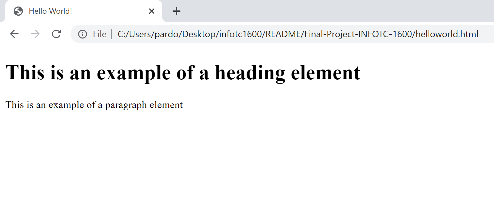

# What is HTML
HTML stands for HyperText Markup Language. HTML is a markup Language used to display document information to be viewed in a web browser. These documents define what content will be on the page and how to display them. 

## HTML Page Setup

You will start off every HTML document by following this basic layout. Below are the five required tags. 

```html
<!DOCTYPE html>
<html>
    <head>
        <title>
            <!-- page title goes here -->
        </title>
    </head>
    <body>
        <!-- body content goes here -->
    </body>
</html>
```
## Basic HTML Document Example
Below I have used HTML elements **h1** and **p** to tell the bowser how to display the content. 
```html
<!DOCTYPE html>
<html>
    <head>
        <title>Hello World!</title>
    </head>
    <body>
        <h1>This is an exaple of a heading element</h1>
        <p> This is an example of a paragraph element</p>
    </body>
</html>
```

## Output


+ [CSS](CSS.md)
+ [Adding CSS to HTML ](HTMLandCSS.md)
+ [Home](README.md)

