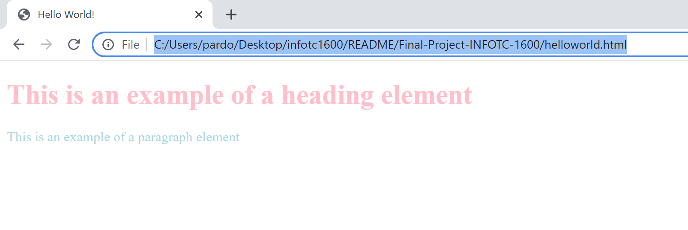
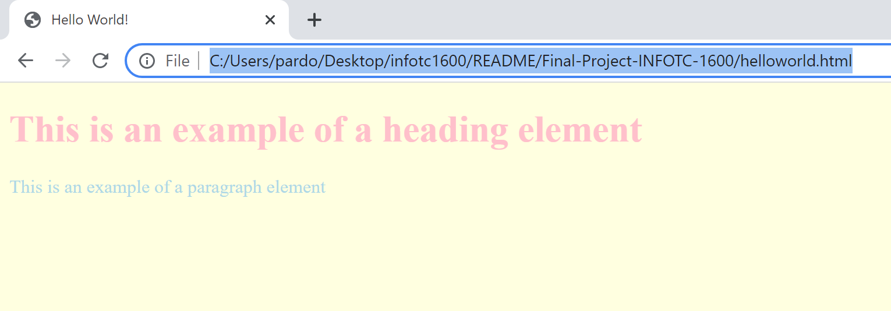

# Adding CSS to HTML (Hello World Tutorial)
There are three ways to add CSS to an HTML document.
1. Inline
2. Internal
3. External

 ## **Inline**
 Found inside of an HTML element using the ``` style ``` attribute. Often used when trying to apply a specific style to one particular HTML element. 

 ## CSS Inline Code Example
 ```html
<!DOCTYPE html>
<html>
    <head>
        <title>Hello World!</title>
    </head>
    <body>
        <h1 style="color:pink;">This is an exaple of a heading element</h1>
        <p style="color:light blue;"> This is an example of a paragraph element</p>
    </body>
</html>
 ```
## Output


 ## **Internal**
 Used in the ``` <head> ``` section by using a ``` <style> ``` element. Often used when trying to style only a single HTML page. 

## CSS Internal Code Example
 ```html
<!DOCTYPE html>
<html>
    <head>
        <title>Hello World!</title>
        <style>
            body {background-color: lightyellow;}

            h1 {color: pink;}
            
            p{color: lightblue;}
        </style>
    </head>
    <body>
        <h1>This is an exaple of a heading element</h1>
        <p> This is an example of a paragraph element</p>
    </body>
</html>
 ```
 ## Output


## **External**
Found in the ``` <head> ``` section by using ``` <link> ``` element

+ [HTML](HTML.md)
+ [CSS](CSS.md)
+ [Home](README.md)